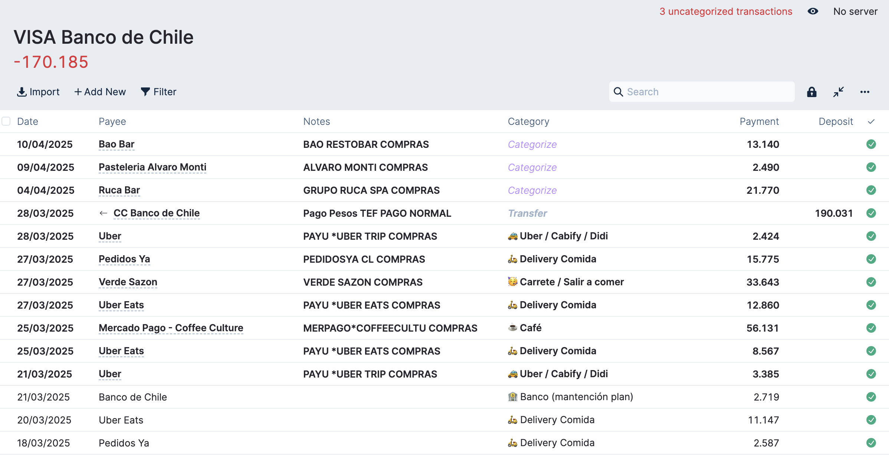
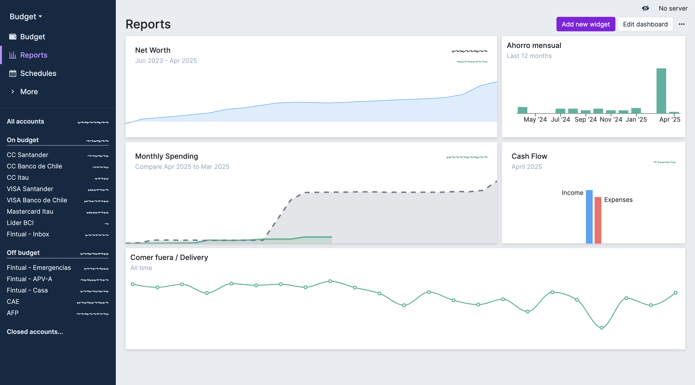

Después de un par de días jugando con mi proyecto para sincronizar Fintoc con Actual Budget, me di cuenta de algo importante: **en verdad, lo que yo necesitaba era muuucho más simple.**

Hace unas semanas les conté que estaba armando un script para automatizar un poquito mis finanzas personales. La idea era conectar Fintoc con Actual Budget y así dejar de ingresar a mano mis transacciones. Automatizar eso, pero sin perder visibilidad de en qué se me iba la plata, cuánto estaba ahorrando, etc. 💡

Pero... trabajando en esto, caché que Fintoc no era lo que necesitaba. Ya sabía que estaba hecho para cosas más pro, tipo conciliación bancaria de empresas o pagos en línea. Pero igual quise probar. Con una cuenta de prueba puedes consumir las transacciones, lo cual está bacán 🙌.

El gran pero: no puedes traer transacciones de **tarjetas de crédito**. Y está bien, no es el caso de uso. Pero para mí, eso lo mataba. 💳❌

**La luz al final del túnel** vino desde el mismo Actual: tiene una feature súper buena que te deja importar transacciones desde archivos QIF, OFX, QFX y CSV. Peeero mis bancos (Santander, Banco de Chile e Itaú) no te dan esos formatos... solo Excel 😑.

Así que lo que hice fue lo siguiente:

---

## 🛠️ Nació una librería: `transactions-chile`

Convertí los Excel a CSV y los importé en Actual. Simple. Pero para no hacerlo a mano cada vez, me armé una pequeña librería en Python con un CLI sencillo que hace justo eso: toma los Excel de tus bancos y los convierte en CSV con un formato estándar, listo para importar en Actual (¡o para lo que quieras!).

🔗 [Link al repo en GitHub](https://github.com/josecannete/transactions-chile)

Por ahora soporta:

- Santander (solo cuenta corriente/vista, no logré sacar las transacciones de la tarjeta de crédito — pónganse las pilas @Santander Chile 👀).
    
- Banco de Chile
    
- Itaú
    

---

### 🎉 Bonus: ¡lo subí a PyPI!

Este fue mi **primer paquete publicado en el Python Package Index (PyPI)** 🐍🚀. Llevo varios años usando Python y ya había subido cositas a package indexes internos del trabajo, pero esto fue otra experiencia. Lo pueden instalar con:

```
pip install transactions-chile
```

🔗 [Link al paquete en PyPI](https://pypi.org/project/transactions-chile/)

---

### 🧠 Pro tip: Copilot + VSCode = 💘

Igual que con el proyecto anterior, usar GitHub Copilot me ayudó un montón. Me tiró sugerencias útiles, me ahorró tiempo y me ayudó a avanzar más rápido. Si no lo han probado, se los recomiendo mucho.

---

Para cerrar, les dejo un par de imágenes de cómo se ve esto importado en Actual y uno de mis reportes (recién estoy empezando a jugar con esto, pero ya se empieza a ver cómo estoy administrando mis lucas). 👀💰📈





---

¿Te tinca? ¿Lo probarías? ¿Te gustaría que soporte más bancos? ¡Escríbeme! 📨