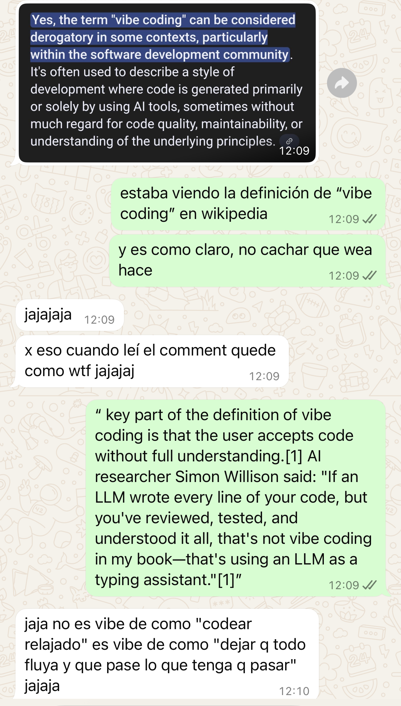

Ayer compartí un post sobre la librería que armé para facilitar mis finanzas. Todo bien... hasta que un amigo me escribió para decirme que le parecía _raro_ que usara el término **“vibe coding”** para describir lo que estaba haciendo.  

Spoiler: tenía razón 😅

Yo estaba usando GitHub Copilot para avanzar más rápido y mejor en mi código. Pero claro, lo que estaba haciendo no era exactamente _vibe coding_.

---

## Entonces, ¿qué es _vibe coding_? 🤔

El término es reciente, y lo popularizó nada menos que Andrej Karpathy en este tuit:  
👉 [https://x.com/karpathy/status/1886192184808149383?s=46&t=J8Y5cmpjHcljGJ1GCg2F4g](https://x.com/karpathy/status/1886192184808149383?s=46&t=J8Y5cmpjHcljGJ1GCg2F4g)

Se refiere a una forma de programar usando modelos de lenguaje (LLMs) como asistentes creativos: les dices _en lenguaje natural_ lo que quieres hacer, y simplemente… aceptas lo que te entregan y sigues construyendo desde ahí.  
Es como _freestylear código_.  🎤💻

No todo lo que sale va a funcionar perfecto, pero muchas veces te deja con algo que está _casi_ ahí.

Como dice Karpathy:

> I just see stuff, say stuff, run stuff, and copy paste stuff, and it mostly works.

---

## Pero también está el otro extremo: _AI Assisted Coding_ 🧠🛠️

En el otro lado del espectro está lo que (por ahora) llamo _AI Assisted Coding_ — no encontré por ahí un nombre más cool, si han visto alguno, me cuentan! 😅

Acá usas los LLMs como ayuda estratégica: te ayudan a programar, escriben código pero tú lo revisas, lo entiendes, lo testeas, y podrías explicárselo a alguien más si te despiertan a las 3am. Como dice Simon Willison en [este post](https://simonwillison.net/2025/Mar/19/vibe-coding/):

> “If an LLM wrote the code for you, and you then reviewed it, tested it thoroughly and made sure you could explain how it works to someone else — that’s not vibe coding, it’s software development.”

Y tiene toda la razón. 

Al final del día, es como cuando llegaron los IDEs con autocompletado: otra herramienta más, poderosa, que te permite:

- arrancar proyectos más rápido 🚀
    
- refactorizar ✨
    
- crear tests sin llorar 😅
    
- y documentar sin sufrir tanto 📚

---

## ¿Cómo lo uso yo? 🤓

Diría que depende mucho del caso. Es un **espectro**.

👉 Si estoy en un lenguaje que no conozco mucho (como cuando conecté Fintoc con Actual Budget en Node.js, que nunca había tocado), me acerco más al _vibe coding_.  
👉 Pero cuando trabajo en algo más familiar (como Python), uso los modelos como asistentes bien entrenados: me ayudan a refactorizar, testear, documentar bien (que es demasiado importante, pero pucha que da lata!).

Uso VSCode con GitHub Copilot, en particular con Claude 3.7 y la verdad es que estoy fascinado. 🔥

---

## En resumen...

Estas herramientas pueden ser lo que tú quieras que sean. Puedes usarlas para hackear cosas rápido (_vibe coding_) o como asistentes para escribir código que te represente y del cual te hagas cargo (_AI assisted coding_).

🎯 Lo importante: la forma de usarlo, dependerá totalmente del caso.

Y ahora te pregunto: **¿Ya estás usando estas herramientas? ¿Hay alguna otra que recomiendes? **👇

---